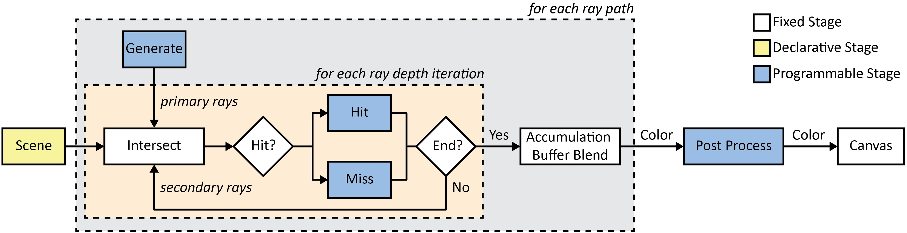
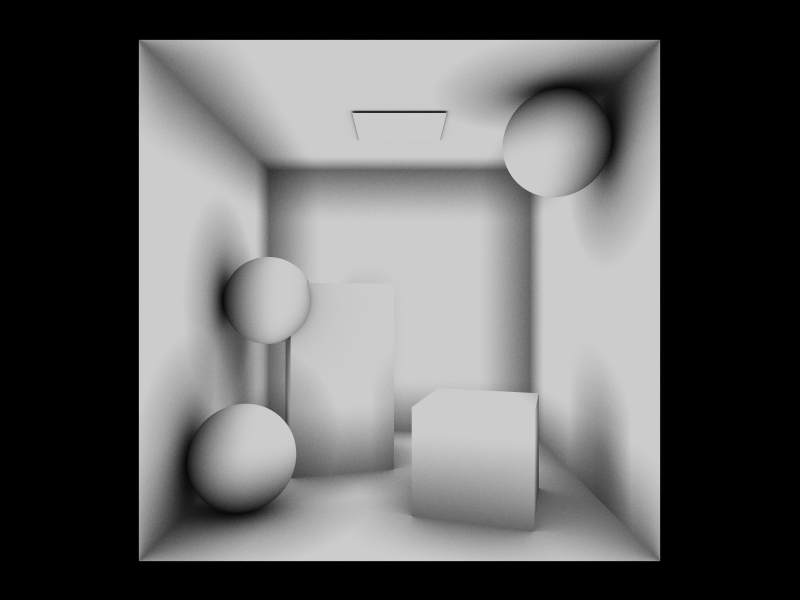

# [Rayground.com: Ray tracing prototyping on the web](https://www.rayground.com)

### Overview

<p style='text-align: justify;'>
Rayground is a web-based framework for rapid prototyping of algorithms based on the ray tracing paradigm. Its main goal is to help develop, test and share self contained modules that showcase a particular method or technique. 
This work aims to demystify ray tracing fundamentals while relying on the established GLSL shading language for code development and the underlying WebGL pipeline for its hidden execution model. It is intended for people who are already familiar with the basics of computer graphics theory and shader-based programming. A detailed documentation of the Rayground's programming interface is available <a href="https://www.rayground.com/documentation"> on-site</a>, coupled with  many demo and tutorial projects, in order tο ease the way of newcomers.
</p>


**Figure 1.** Rayground logo illuminated and shaded with a simple path tracer implementation. Project link can be found <a href="https://www.rayground.com/view/WwBwf-k639U"> here </a>.

### Table of Contents

- [Prerequisites](#Prerequisites)
- [Aim](#Aim)
- [Description](#Description)
- [Path tracing in one hour](#Path-tracing-in-one-hour)
- [Research Achievements](#Research-Achievements)
- [Example Projects](#Example-Projects)

## Prerequisites

Rayground is open, cross-platform, and available to everyone. It does not rely on any browser plugins and thus runs on any platform that has a modern standards compliant browser. Specifically, the website runs only on WebGL2-enabled browsers and requires the `EXT_color_buffer_float` extension. 

### Tested Configurations

Rayground has been successfully tested with the following configurations:

| **Device**        | **Graphics Card**         | **OS**                          | **Browser**                | **Status** | **Issues** |
|:---               |:---                       |:---                             |:---                        |:---   |:---   
|Personal Computer           | Nvidia GeForce GTX 670    | Ubuntu 18.04.4 LTS      | Chrome, Firefox            | Success | -
|Personal Computer           | Nvidia GeForce RTX 2080   | Windows 10 Pro          | Chrome, Firefox            | Success | -
|MacBook Pro 13-inch, Mid 2009           | NVIDIA GeForce 9400M | OS X El Capitan          | Chrome, Firefox            | Success | -
|Xiaomi Redmi Note 6 Pro      | Adreno 509 | Android 9 Pie          | Chrome            | Success | - 
|Raspberry Pi 4 model B      | Broadcom VideoCore VI | Raspbian          | Chrome            | Success | in complex projects 

## Aim

The goals of this github account are: 
- Guide newcomers with a step-by-step navigation to the Rayground' API through a simple path tracing implementation.
- Inform the active users what new [features](https://github.com/cgaueb/rayground/projects) are coming in the next version(s) of the website.
- Offer accessibility for bug reporting, enhancements or feature [requests](https://github.com/cgaueb/rayground/issues).
- Provide a brief summary of successful projects.

## Description

Rayground aims to demystify raytracing fundamentals, by providing a well-defined WebGL-based programmable graphics pipeline of configurable distinct raytracing stages coupled with a simple scene description format. The graphical user interface of Rayground is designed to have two discrete parts, the _preview window_ and the _shader editor_, similar to the layout of 
<a href="https://www.shadertoy.com/"> ShaderToy</a>, which many shader developers are already familiar with (Fig. 2). Visual feedback is interactively provided in the WebGL rendering context of the preview canvas, while the user performs live source code modifications. Rayground  follows a  programmable GPU-accelerated ray-tracing pipeline in order to give developers direct and flexible control of five ray tracing stages through a simple, high-level shader-based programming model. Thus, the shader editor  consists  of  five  tabs,  corresponding  to  five  customisable shader stage, namely _Scene_, _Generate_, _Hit_, _Miss_ and _PostProcess_.


**Figure 2.** (Left) The Rayground interface, with the _preview window_ and the _shader editor_, showing the _Generate_ stage. (Middle and Right) _Hit_ and _Miss_ event shaders for the same project, where the Cornell Box scene is rendered using a simple path tracer. Complete implementation details can be found 
<a href="https://www.rayground.com/view/dExaQa67tqI"> here</a>.

### Ray Tracing Pipeline

At the core of Rayground there is a traditional ray tracing image synthesis pipeline, with several programmable stages via event handling shaders. It was designed with the aim to help users gradually understand how a ray tracer works, without getting distracted by the particular implementation of the framework or platform-specific characteristics. Since ray tracing is now tightly integrated into modern real-time rendering APIs (Optix, DX12, Vulkan), we follow a similar programming model. 
The geometric objects of the scene are initially specified in the input **Scene** declaration stage. These objects are used to build ray intersection acceleration data structures, which in our case, are not programmable. Primary rays, which, in the simplest case correspond to a virtual camera, are generated and submitted for intersection in the **Generate** stage. Depending on the intersection results, execution switches to the closest **Hit** or **Miss** stage. Both events can
generate a new ray which, in turn, may be intersected with the scene to trigger new events.
Users are provided with several built-in and user-controlled properties that ease the data transmission between events.
For each iteration of the pipeline, or _frame_, a pixel colour is computed and blended with the previous values stored in an **Accumulation Buffer**. All code segments execute in parallel for each pixel of the _Canvas_, i.e. the preview window and, in every frame, the executed code directly corresponds to the one iteration event, i.e. one ray path. The intermediate image is finally filtered through a **PostProcess** stage, a common step prior to image presentation, handy for tone mapping and filtering operations. A graphical illustration of the pipeline is shown in the following figure.


**Figure 3.** High level overview of the Rayground pipeline. 

### Rayground API 

The Rayground API is implemented using the WebGL2 standard, supporting shader programming via GLSL, thus providing a convenient and familiar code development interface. The user is encouraged to use built-in GLSL functions (e.g. dot, cross) and types (e.g. vec4, mat4). However, any use of the standard input and output variables of the GLSL programmable pipeline stages (e.g. gl_FragCoord) as well as samplers (e.g. sampler2D) may result in undefined behaviour and should be avoided. While certain functionality is common to all stages, there are also stage-specific input and output variables, which are described below in more detail. The basic functionality of Rayground API is listed in the following table. A detailed explanation of the Rayground's programming interface can be found in the <a href="https://www.rayground.com/documentation"> documentation section</a> of Rayground site.

| **Type**  | **Name**              | **Description** |
|:---       |:---                   |:---|
|**_All stages_**                                                           |
|`in  vec2`     | `rg_Canvas`           | canvas resolution in pixels       |
|`in  vec2`     | `rg_Pixel`            | pixel coordinates relative to the lower left corner of the canvas |
|`in  int`      | `rg_Frame`            | current frame counter             |
|`in  float`    | `rg_Time`             | time in seconds since simulation start, updates in every frame             |
|`in  uvec4`    | `rg_Seed`             | cpu generated seed values, updated for each stage             |
|`in  float`    | `RG_RAY_MAX_DISTANCE` | 1.e27             |
|`in  float`    | `RG_RAY_ACTIVE_FLAG`  | 1.0               |
|`in  float`    | `RG_RAY_INACTIVE_FLAG`| 0.0               |
|`in  float`    | `RG_PI`               | 3.14159265359     |
|`in  vec4`     | `rg_Random(uint i, uint s0, uint s1)`     | Obtain 4 random values from a counter-based pseudo-random sequence |
|**_Generate/Hit/Miss stages_**                                         |
|`out vec4`     | `rg_RayOrigin`        | output ray origin (.xyz position, .w active flag) |
|`out vec4`     | `rg_RayDirection`     | output ray direction (.xyz direction, .w max travel distance)    |
|`out vec4`     | `rg_Payload0..3`      | output ray payload values                |
|`out vec4`     | `rg_Accumulation`     | output ray accumulation color (.rgb values, .a additive blending factor)|
|`in  vec4`     | `rg_PrevRayOrigin`    | input ray origin               |
|`in  vec4`     | `rg_PrevRayDirection` | input ray direction            |
|`in  vec4`     | `rg_PrevPayload0..3`  | input ray payload              |
|`in  vec4`     | `rg_PrevAccumulation` | input ray accumulation color   |
|`in  int`      | `rg_Depth`            | ray depth iteration, starts at 0 and gets incremented after each intersection |
|`bool`         | `rg_TraceOcclusion(vec3 o, vec3 d, float t)`           | occlusion query along a specified ray segment |
|**_Generate stage_**                                             |
|`void`         | `rg_generate(void)`   | entry point signature   |
|**_Hit stage_**                                                  |
|`void`         | `rg_hit(void)`        | entry point signature   |
|`in vec3`      | `rg_Hitpoint`         | hit in world space coordinates |
|`in vec3`      | `rg_Normal`           | geometric normal of the intersected primitive |
|`in int`       | `rg_MaterialID`       | material ID of the intersected primitive |
|`vec4`         | `rg_MaterialPropertyI(int id)`    | material properties as specified in the scene stage, where I=[0,7] |
 |**_Miss stage_**                                                 |
|`void`         | `rg_miss(void)`       | entry point signature   |
|**_PostProcess stage_**                                          |
|`void`         | `rg_post_process(void)` | entry point signature |
|`vec4`         | `rg_PixelColor`         | final pixel color to be presented |
|`rg_Image2D`   | `rg_AccumulatedImage`   | 2D image buffer with the accumulated values (after blending operation) |
|`vec4`         | `rg_ImageFetch2D(rg_Image2D I, ivec2 uv)`       | 2D image fetch from the specified pixel coordinates |

## Path tracing in one hour

We provide here a basic example, in order to present the pipeline and demonstrate Rayground’s API mechanisms. It implements
a simple unidirectional path tracer for diffuse surfaces in only a few lines of code. For clarity, the code of certain functions, commonly encountered in a typical path tracer, has been omitted (function declarations are included in the code listings below). Figures 2 (left) and 4 illustrate how the Cornell Box scene is illuminated using this code after 500 samples per pixel. For more details, the interested reader can find the complete working example <a href="https://www.rayground.com/view/dExaQa67tqI"> here</a>.

### a) Scene stage 

The Cornell Box scene is trivially represented using five quads and two cubes for the diffuse geometry. The material properties are configured accordingly to set the colour for diffuse surfaces. The maximum iteration depth of the scene is set
to five since additional bounces will add negligible radiance contribution.

### b) Generate stage

After the scene description, this stage is used to implement a simple pinhole perspective camera. The **rg_Pixel**
and **rg_Canvas** attributes are used to calculate a ray going through the centre of each pixel for a perspective camera with a 45 field of view. The generated rays are then submitted for intersection after preparing their **rg_RayOrigin** and **rg_RayDirection** variables. Additionally, the **rg_Accumulation** and **rg_Payload0** values are also initialised for each generated ray at this step. 

```glsl
vec3 get_camera_ray_dir(vec3 eye, vec3 target, float aperture, bool jitter);

void rg_generate() {
    
    /* Set Camera Parameters */
    vec3  eye       = vec3(0.0, 0.5, 3.0);
    vec3  target    = vec3(0.0, 0.5, 0.0);
    float fov       = 45.0;
    bool  jitter    = true;
 
    /* Generate a Ray based on a Pinhole Perspective Camera */
    vec3  dir       = get_camera_ray_dir(eye, target, fov, jitter, rg_Pixel, rg_Canvas);
    
    /* Submit Primary Ray */
    rg_RayOrigin    = vec4(eye, RG_RAY_ACTIVE_FLAG);
    rg_RayDirection = vec4(dir, RG_RAY_MAX_DISTANCE);

    /* Initialize Accumulation and Payload */
    rg_Accumulation = vec4(0.0, 0.0, 0.0, 1.0/float(rg_Frame));
    rg_Payload0     = vec4(1.0);
}
```

### c) Ray Intersection stage (not programmable)

In a following fixed stage, the intersection of the primary rays with the scene entities is performed by the core ray tracing engine and the corresponding events for each event (hit or miss) are subsequently triggered.

### d) Hit stage

This stage, called upon valid ray-object intersections, demonstrates the radiance accumulation process for the diffuse Monte
Carlo path tracer using next event estimation; the direct illumination of each ray path is estimated by testing the intersected point for visibility with a punctual light source, using a shadow ray, and accounting for its contribution to the incident radiance. The important steps at this stage are the computation of the incoming illumination at the intersected point, the generation of a new ray and the storage of the light throughput at the current ray path. These computations
can be trivially accomplished using the provided Rayground variables. For example, information about the intersected point can be obtained using **rg_Hitpoint**, **rg_Normal** and **rg_MaterialProperty**.
To check for visibility, the **rg_TraceOcclusion()** casts a shadow ray between the intersection point and the light source position. Two final operations are necessary to complete the shader. First, new rays are submitted for intersection by writing the appropriate values to **rg_RayOrigin** and **rg_RayDirection** and making sure the **RG_ACTIVE_FLAG** is set in the fourth coordinate of **rg_RayOrigin**. Second, the **rg_Accumulation** and **rg_Payload0** variables are updated to store the gathered radiance and the accumulated light throughput, recursively.

```glsl
float get_pdf              (vec3 n, vec3 d);
float get_ndotl            (vec3 n, vec3 wi);
vec3  get_diffuse_bsdf     (vec3 c);
vec3  get_new_ray_direction(vec3 n);

void rg_hit() {

    /* Set Light Parameters */
    vec3 light_pos          = vec3(0,0.999,0);
    vec3 light_intensity    = vec3(1.5);

    /* Connect Hit Point to Light Source */
    float ray_offset        = 0.001;
    vec3  dir_to_light      = normalize(light_pos - rg_Hitpoint);
    float dist              = distance (light_pos, rg_Hitpoint);
    vec3  shadow_ray        = rg_Hitpoint + ray_offset*dir_to_light;

    /* Send Shadow Ray */
    float dist_bias         = dist - ray_offset*2.0;
    float visibility        = rg_TraceOcclusion(shadow_ray, dir_to_light, dist_bias) ? 0.0 : 1.0;

    /* Get the NdotL Factor */
    float NdotL             = get_ndotl(rg_Normal, dir_to_light);

    /* Get the Material Value */
    vec3 diffuse_mat        = rg_MaterialProperty0(rg_MaterialID).rgb;
    vec3 bsdf               = get_diffuse_bsdf(diffuse_mat);

    /* Compute the New Colour Value */
    vec3 Li                 = light_intensity*visibility;
         Li                /= (dist*dist+0.001);
    vec3 radiance           = Li*bsdf*NdotL;
    
    /* Create the New Ray */
    vec3 pos                = rg_Hitpoint + ray_offset*rg_Normal;
    vec3 dir                = get_new_ray_direction(rg_Normal);
    rg_RayOrigin            = vec4(pos, RG_RAY_ACTIVE_FLAG);
    rg_RayDirection         = vec4(dir, RG_RAY_MAX_DISTANCE);
    
    /* Update Colour and Throughput Values */
    rg_Accumulation         = rg_PrevAccumulation;
    rg_Accumulation.rgb    += rg_PrevPayload0.rgb*radiance.rgb;
    float pdf               = get_pdf(rg_Normal, dir);
    float NdotI             = max(0.0, dot(rg_Normal, dir));
    vec3 throughput         = bsdf*NdotI/pdf;
    rg_Payload0             = rg_PrevPayload0;
    rg_Payload0.rgb        *= throughput.rgb;
}
```

### e) Miss stage

This stage is called when an intersection with the scene is not found. In this example, the shader simply terminates
the ray shooting and sets the incoming colour value to the **rg_Accumulation** buffer.

```glsl
void rg_miss() {

    /* Terminate Ray Shooting */
    rg_RayOrigin    = vec4(0.0, 0.0, 0.0, RG_RAY_INACTIVE_FLAG);
    rg_RayDirection = vec4(0.0);
    
    /* Set Accumulation Colour and Blending Factor */
    rg_Accumulation = rg_PrevAccumulation;
}
```

### e) PostProcess stage

Finally, this stage applies a basic gamma correction filter to each cell of the accumulated buffer and assigns the
resulting values to the corresponding output canvas pixel through **rg_PixelColor**.

```glsl
vec4 gamma_correction(vec4 color, float gamma);

void rg_post_process() {
    
    /* Get Accumulation Buffer */
    vec4 image    = rg_ImageFetch2D(rg_AccumulatedImage, ivec2(rg_Pixel));
    
    /* Perform Gamma Correction */
    rg_PixelColor = gamma_correction(image, 2.2));
}
```

### f) Final Image 

</br>
**Figure 4.** Unidirectional diffuse path tracer.

## Research Achievements

**Motivation**. The advent of mass-produced, consumer grade hardware with raytracing acceleration capabilities has significantly boosted the interest of the graphics community and has led to the introduction of related methods to interactive applications, thus demonstrating its wide applicability to students. Unfortunately, this turn of interest to ray-tracing-based techniques is not sufficiently backed by proper educational tools to assist students in becoming familiar with the basic concepts and help them become practically engaged in building their own projects. Moreover, modern low-level graphics APIs, either dedicated to ray tracing like NVIDIA OptiX or supporting it, such as Microsoft DirectX 12 and Khronos Group Vulkan, pose high entry barriers to students and require a very daunting and long learning process, riddled with many distracting technicalities.

**Idea**. In [VGV+20], Rayground is used as an online, interactive education tool for richer in-class teaching and gradual self-study by providing a convenient introduction into practical ray tracing. In this work, an extensive discussion is offered describing how both undergraduate (Fig. 5) and postgraduate (Fig. 6) computer graphics theoretical lectures and laboratory sessions can be enhanced by Rayground, in order to achieve a broad understanding of the underlying concepts. For more details please refer to the original manuscript provided below.

**[VGV+20]** Vitsas N., Gkaravelis A., Vasilakis A. A., Vardis K., Papaioannou G., '_Rayground: An Online Educational Tool for Ray Tracing_'. In Eurographics 2020 - Education Papers (2020), The Eurographics Association.<br/><br/>
<a href="https://diglib.eg.org/bitstream/handle/10.2312/eged20201027/001-008.pdf" target="_blank">

</a>
<a href="Multimedia/eg2020_edu_RG_presentation.pptx" target="_blank">

</a>
<a href="https://youtu.be/isLY6yUIMMA" target="_blank">

</a>

**Figures.**


**Figure 5.** Output of the first (a-c) and second (d) undergraduate lab sessions. 
a) <a href="https://www.rayground.com/view/WmVHCgz0qss"> Unlit shading of supported primitives. </a>
b) <a href="https://www.rayground.com/view/7_Pl0NIBFdQ"> Cornell Box using normal vector colouring </a> and 
c) <a href="https://www.rayground.com/view/H-Ve5hrVPug"> Lambertian shading</a>.
d) <a href="https://www.rayground.com/view/LYnWPJNFuPU"> Whitted-style ray tracing</a>.


**Figure 6.** Output of the graduate lab session tasks. 
a) <a href="https://www.rayground.com/view/RuVlw5EAs9A"> Ambient occlusion</a>.
b) <a href="https://www.rayground.com/view/feYfjVF3fXM"> Unidirectional path tracer using importance sampling</a>.
c) <a href="https://www.rayground.com/view/KIemz357k5A"> Comparison of BRDF versus light importance sampling</a>.
d) <a href="https://www.rayground.com/view/WfC8cSyuX6Y"> Volumetric rendering</a>.

## Example Projects

### <a href="https://raytracing.github.io/books/RayTracingInOneWeekend.html"> 1. Ray Tracing in One Weekend </a> 


#### Rayground links

<a href="https://www.rayground.com/view/_UfKcxB3gas"> Chapter 4  - Rays, a Simple Camera, and Background </a> by <a href="https://www.rayground.com/users/abasilak"> abasilak </a> </br>
<a href="https://www.rayground.com/view/sRK1FhKNKc0"> Chapter 5  - Adding a Sphere </a> by <a href="https://www.rayground.com/users/abasilak"> abasilak </a> </br>
<a href="https://www.rayground.com/view/A5ACqnpz3M4"> Chapter 6  - Surface Normals and Multiple Objects </a> by <a href="https://www.rayground.com/users/abasilak"> abasilak </a>  </br>
<a href="https://www.rayground.com/view/lNwc6PhzGHQ"> Chapter 7  - Antialiasing </a> by <a href="https://www.rayground.com/users/abasilak"> abasilak </a> </br>
<a href="https://www.rayground.com/view/-o_deCr290Y"> Chapter 8  - Diffuse Materials </a> by <a href="https://www.rayground.com/users/abasilak"> abasilak </a> </br>
<a href="https://www.rayground.com/view/1vUO9oRPNQU"> Chapter 9  - Metal </a> by <a href="https://www.rayground.com/users/abasilak"> abasilak </a> </br>
<a href="https://www.rayground.com/view/tdUZeZ29Y2I"> Chapter 10 - Dielectrics </a> by <a href="https://www.rayground.com/users/abasilak"> abasilak </a> </br>
<a href="https://www.rayground.com/view/NSGnYLZjYqc"> Chapter 11 - Positionable Camera </a> by <a href="https://www.rayground.com/users/abasilak"> abasilak </a> </br>
<a href="https://www.rayground.com/view/1cdXcNivq58"> Chapter 12 - Defocus Blur </a> by <a href="https://www.rayground.com/users/abasilak"> abasilak </a> </br>
<a href="https://www.rayground.com/view/2hucHmtxldY"> Chapter 13 - Where Next? </a> by <a href="https://www.rayground.com/users/abasilak"> abasilak </a> </br>

### <a href="https://raytracing.github.io/books/RayTracingTheNextWeek.html"> 2. Ray Tracing the Next Week </a> 


#### Rayground links

<a href="https://www.rayground.com/view/szTlW7Tb7Nk"> Chapter 4  - Solid Textures </a> by <a href="https://www.rayground.com/users/abasilak"> abasilak </a> </br>
<a href="https://www.rayground.com/view/9xM4xAb6KJ4"> Chapter 5  - Perlin Noise </a> by <a href="https://www.rayground.com/users/abasilak"> abasilak </a> </br>
<a href="https://www.rayground.com/view/Ag2PFM0Ww-U"> Chapter 6  - Image Texture Mapping </a> by <a href="https://www.rayground.com/users/abasilak"> abasilak </a> </br>
<a href="https://www.rayground.com/view/DPPp6Gb5ZZg"> Chapter 7  - Rectangles and Lights </a> by <a href="https://www.rayground.com/users/abasilak"> abasilak </a> </br>
<a href="https://www.rayground.com/view/elkPNzPc5qA"> Chapter 8  - Instances </a> by <a href="https://www.rayground.com/users/abasilak"> abasilak </a> </br>
<a href="https://www.rayground.com/view/bKLY3YWRzPg"> Chapter 9  - Volumes </a> by <a href="https://www.rayground.com/users/abasilak"> abasilak </a> </br>

### <a href="https://dl.acm.org/doi/abs/10.1145/1198555.1198743"> 3. Whitted Ray Tracing </a> 


#### Rayground links

<a href="https://www.rayground.com/view/LYnWPJNFuPU"> Whitted </a> by 
<a href="https://www.rayground.com/users/Vineek"> Vineek </a> </br>

### <a href="https://dl.acm.org/doi/abs/10.1145/1198555.1198743"> 4. Ambient Occlusion </a> 



#### Rayground links

<a href="https://www.rayground.com/view/RuVlw5EAs9A"> Ambient Occlusion
 </a> by 
<a href="https://www.rayground.com/users/Agkar"> Agkar </a> </br>

## Open-Source Libraries

Rayground would not have been possible without these amazing open-source technologies:

- <a href="http://www.codemirror.net/"> Code Mirror </a>
- <a href="https://github.com/chadaustin/sajson"> sajson </a>
- <a href="https://webassembly.org/"> WebAssembly </a> through <a href="https://emscripten.org/"> emscripten </a>
- <a href="https://github.com/mrdoob/stats.js/"> stats.js </a>
- <a href="https://sweetalert2.github.io/"> sweetalert2 </a>
